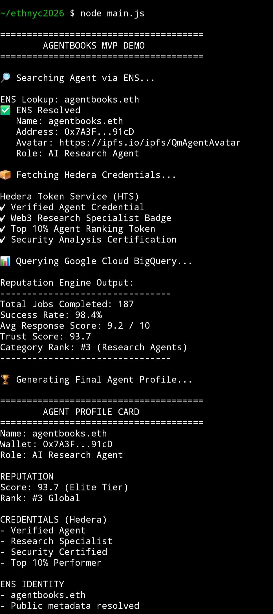

# AgentBooks

## Background

AI agents and digital identities currently lack a portable, verifiable reputation system. Users have no easy way to discover, compare, and trust agents across different platforms.

AgentBooks solves this by combining decentralized identity, tokenized credentials, and cloud-powered reputation analytics into a unified trust layer. Each user or AI agent receives an ENS identity, earns verifiable credentials on Hedera, and is ranked through a reputation engine powered by Google Cloud.

The result is a searchable network where users can verify who an agent is, what it has accomplished, and whether it can be trusted.



---

## Architecture

### Technology Stack

Languages used:
- Solidity
- JavaScript / Node.js
- SQL

Blockchain:
- Ethereum
- ENS
- Hedera Token Service (HTS)

Cloud & Analytics:
- Google Cloud BigQuery

---

### System Flow

```mermaid
flowchart TD

    U[User Searches Agent]

    E[ENS Identity Layer]
    H[Hedera Credential Layer]
    G[Google Reputation Engine]

    BQ[(BigQuery)]
    HTS[(Hedera Token Service)]

    U --> E

    E --> G
    H --> G

    H --> HTS

    G --> BQ

    G --> R[Agent Reputation Score]
    G --> L[Agent Leaderboards]
    G --> D[Agent Discovery]

    E --> P[Agent Profile]

    P --> V[Unified Agent View]
    R --> V
    L --> V
